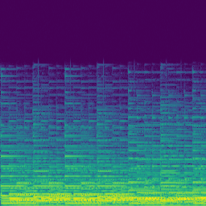

# Pix2Pix Timbre Transfer
 Musical Timbre Transfer using the Pix2Pix architecture

The pix2pix architecture has proven effective for natural images, and the authors of the original paper claim that it can perform well the problem of image-to-image translation. However, synthetic images may present a challenging use scenario. In this work, we focus on using the pix2pix architecture to generate audio in a similar fashion as the style transfer problem to test the performance of this network. 

### What is musical timbre transfer?

Musical timbre transfer consists on obtaining a melody played by a target instrument given the same melody played by the original instrument. Namely, the process changes the style from one instrument into another preserving the semantic content of the song. 

#### A visual example

The following table shows one STFT spectrogram frame of the same melody played by the 4 different instruments considered in this work. These images serve as input and output for the Pix2Pix network. A more detailed explanation about spectrograms can be found in section "Methodology".

 |  |  |  
--- | --- | --- | ---
Keyboard acoustic | Guitar acoustic | String acoustic | Synth Lead Synthetic

The objective of this project is to train a network that is able to perform image translation between any instrument pair of this set. For simplicity, the Keyboard is considered the canonical instrument such that the translations presented here have Keyboard as origin and any of the remaining 3 as target. 

# Quick reference
### Environment setup
Clone this repository to your system.
```
$ git clone https://github.com/hmartelb/[].git
```
Make sure that you have Python 3 installed in your system. It is recommended to create a virtual environment to install the dependencies. Open a new terminal in the master directory and install the dependencies from requirements.txt by executing this command:
```
$ pip install -r requirements.txt
```
### Dataset
Download the NSynth Dataset and the Classical Music MIDI Dataset.
* The NSynth Dataset, “A large-scale and high-quality dataset of annotated musical notes.” 
https://magenta.tensorflow.org/datasets/nsynth

* Classical Music MIDI Dataset, from Kaggle 
https://www.kaggle.com/soumikrakshit/classical-music-midi

Generate the audios and the features with the following scripts. Optional arguments are displayed in brackets “[ ]”.
```
$ python synthesize_audios.py --nsynth_path <NSYNTH_PATH>
                              --midi_path <MIDI_PATH>
                              --audios_path <AUDIOS_PATH>
                             [--playback_speed <PLAYBACK_SPEED>]
                             [--duration_rate <DURATION_RATE>]
                             [--transpose <TRANSPOSE>]
```

```
$ python compute_features.py --audios <AUDIOS_PATH> 
			    --features <FEATURES_PATH>
```
### Pix2Pix training
Train the Pix2Pix network with the train.py script, specifying the instrument pair to convert from origin to target, and the path where the dataset is located. 
```
$ python train.py --dataset_path <DATASET_PATH> 
                  --origin <ORIGIN>
                  --target <TARGET>
                 [--gpu <GPU>] 
                 [--epochs <EPOCHS>]
                 [--epoch_offset <EPOCH_OFFSET>] 
                 [--batch_size <BATCH_SIZE>]
                 [--gen_lr <GENERATOR_LEARNING_RATE>] 
                 [--disc_lr <DISCRIMINATOR_LEARNING_RATE>]
                 [--validation_split <VALIDATION_SPLIT>] 
                 [--findlr <FINDLR>]
```
### Generator only training
It is also possible to train only the generator network with the train_generator.py script, specifying the instrument pair to convert from origin to target, and the path where the dataset is located. 
```
$ python train_generator.py --dataset_path <DATASET_PATH> 
                            --origin <ORIGIN>
                            --target <TARGET>
                           [--gpu <GPU>] 
                           [--epochs <EPOCHS>]
                           [--epoch_offset <EPOCH_OFFSET>] 
                           [--batch_size <BATCH_SIZE>]
                           [--lr <LEARNING_RATE>] 
                           [--validation_split <VALIDATION_SPLIT>] 
                           [--findlr <FINDLR>]
```

### Using a pretrained model

# Methodology

The pix2pix architecture has been designed for image processing tasks, but in this case the format of the data is audio. Therefore, a preprocessing step to convert a 1D audio signal into a 2D signal (image) is required.

### Obtaining a Time-Frequency representation

Audio applications using Machine Learning typically work better in Frequency domain than in Time domain. If an appropriate time-frequency transform, like the Short Time Fourier Transform (STFT) is applied to the time domain signal, the result is a 2D representation called a Spectrogram where the axes correspond to time (horizontal) and frequency (vertical).  

 |  
--- | --- 
Time domain (Waveform) | Frequency domain (Spectrogram, STFT)

The spectrograms are computed from the audios using the librosa.stft() function with a Hanning window of size 1024 and an overlap of 50% (hop size of 512), which gives a resolution of 513 frequency bins. The Sampling Rate of the input audio is 44.1kHz. These parameters have been found to provide a reasonable time-frequency compromise for this application. 

One observation is that the original Sampling Rate of 16kHz of the NSynth dataset makes the spectrograms have no content above 8kHz, according to the Nyquist-Shannon sampling theorem (https://en.wikipedia.org/wiki/Nyquist–Shannon_sampling_theorem). Since the spectrograms are computed up to 22.05kHz in this case, as we use a Sampling Rate of 44.1kHz for professional audio, it is safe to trim one half of the image corresponding to High Frequencies because there is no content (i.e. the magnitude is all zeros in this region).

Strictly speaking, the values of the Spectrogram returned by the STFT operation are complex numbers. Therefore, for the network to process the data it needs to be decomposed further. The magnitude of the signal is the modulus of Spectrogram, namely np.abs(S) and the phase of the signal is the angle, obtained as np.angle(S). 

The component that carries the most relevant information is the magnitude, and it is the only one passed to the network, as shown in this diagram:


### Reconstructing the audio

Both magnitude and phase are required to reconstruct the audio from a Spectrogram, so we need to estimate the phase in some way.
Generating flat or random phases does not produce a decent result. Therefore, a more sophisticated phase estimation method is also necessary. The following can be implemented in the “Phase estimator” block as possible solutions: 

1.	Griffin-Lim algorithm 
(https://pdfs.semanticscholar.org/14bc/876fae55faf5669beb01667a4f3bd324a4f1.pdf)
2.	Reconstruction using the input phase (the phase estimator is the identity function)
3.	Alternatively: 
* Use another Pix2Pix network to learn the phase
* Pass magnitude and phase as 2 channels to a single Pix2Pix network

Some authors from the research literature claim that (1) may not converge into an acceptable result [https://arxiv.org/pdf/1811.09620.pdf], and any of the proposals in (3) is error prone since it can produce inconsistent spectrograms that are not invertible into a time-domain signal [http://www.jonathanleroux.org/pdf/Gerkmann2015SPM03.pdf]. 

Consequently, (2) has been chosen for being the one with less computational cost, less error prone, and best perceptual output quality. 
