# Pix2Pix Timbre Transfer
 Musical Timbre Transfer using the Pix2Pix architecture
 
 # Table of contents

* [Introduction](#introduction)
* [Quick reference](#quick-reference)
* [Methodology](#methodology)
* [Dataset](#dataset)
* [Training](#training)
* [Results](#results)
* [Conclusion](#conclusion)
* [Future work](#future-work)
* [Acknowledgements](#acknowledgements)
* [Contact](#contact)
* [License](#license)

# Introduction
>[Table of contents](#table-of-contents)

The Pix2Pix architecture has proven effective for natural images, and the authors of the [original paper](https://arxiv.org/pdf/1611.07004.pdf) claim that it can perform well the problem of image-to-image translation. However, synthetic images may present a challenging use scenario. 

In this work, we use the Pix2Pix architecture for a substantially different application: to generate audio in a similar fashion as the style transfer problem. 

### What is musical timbre transfer?

Musical timbre transfer consists on obtaining a melody played by a target instrument given the same melody played by the original instrument. Namely, the process changes the style from one instrument into another preserving the semantic content of the song. 

#### An audible example

The best way to understand the problem is to listen to some audio examples. 

In particular, the 4 from the ``/docs/examples`` folder of this repository should provide an idea and are the ones that will be used thoughout this documentation. 

[Keyboard acoustic](https://drive.google.com/open?id=16SWVM3JSN_PM6pcNvPzWbiUYZs328u8F)
[Guitar acoustic](https://drive.google.com/open?id=1hGWHfV03yok2NSfXipK7KDVp9kTbUbjH)
[String acoustic](https://drive.google.com/open?id=1mpaovd5T2IaXee2CyOWrUXEXRHg64LeB)
[Synth Lead synthetic](https://drive.google.com/open?id=1VKfm4iGLnDPLn3BZ14yAcv5wFA6-bMms)
--- | --- | --- | ---

>To make listening easier while viewing this documentation, the reader can access them from the above links to Google Drive, where they are stored

#### A visual example

The following table shows one STFT spectrogram frame of the same melody from the above examples, played by the 4 different instruments considered in this work. These images serve as input and output for the Pix2Pix network. 
> A more detailed explanation about spectrograms can be found in section [Methodology](#methodology).

 |  | 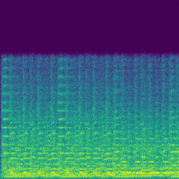 | 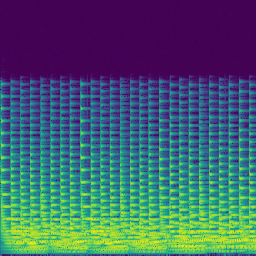 
--- | --- | --- | ---
Keyboard acoustic | Guitar acoustic | String acoustic | Synth Lead synthetic

#### Scope of the project
The objective of this project is to train a network that is able to perform image translation between any instrument pair of this set. For simplicity, the Keyboard is considered the canonical instrument such that the translations presented here have Keyboard as origin and any of the remaining 3 as target. 

# Quick reference
>[Table of contents](#table-of-contents)

### Environment setup
Clone this repository to your system.
```
$ git clone https://github.com/hmartelb/Pix2Pix-Timbre-Transfer.git
```
Make sure that you have Python 3 installed in your system. It is recommended to create a virtual environment to install the dependencies. Open a new terminal in the master directory and install the dependencies from requirements.txt by executing this command:
```
$ pip install -r requirements.txt
```
### Dataset generation
Download the NSynth Dataset and the Classical Music MIDI Dataset.
* The NSynth Dataset, “A large-scale and high-quality dataset of annotated musical notes.” 
https://magenta.tensorflow.org/datasets/nsynth

* Classical Music MIDI Dataset, from Kaggle 
https://www.kaggle.com/soumikrakshit/classical-music-midi

Generate the audios and the features with the following scripts. Optional arguments are displayed in brackets “[ ]”.
```
$ python synthesize_audios.py --nsynth_path <NSYNTH_PATH>
                              --midi_path <MIDI_PATH>
                              --audios_path <AUDIOS_PATH>
                             [--playback_speed <PLAYBACK_SPEED>]
                             [--duration_rate <DURATION_RATE>]
                             [--transpose <TRANSPOSE>]
```

```
$ python compute_features.py --audios <AUDIOS_PATH> 
			    --features <FEATURES_PATH>
```
### Pix2Pix training
Train the Pix2Pix network with the ``train.py`` script, specifying the instrument pair to convert from origin to target, and the path where the dataset is located. 
```
$ python train.py --dataset_path <DATASET_PATH> 
                  --origin <ORIGIN>
                  --target <TARGET>
                 [--gpu <GPU>] 
                 [--epochs <EPOCHS>]
                 [--epoch_offset <EPOCH_OFFSET>] 
                 [--batch_size <BATCH_SIZE>]
                 [--gen_lr <GENERATOR_LEARNING_RATE>] 
                 [--disc_lr <DISCRIMINATOR_LEARNING_RATE>]
                 [--validation_split <VALIDATION_SPLIT>] 
                 [--findlr <FINDLR>]
```

### Conditioned Pix2Pix training (multitarget)
The ``train_multitarget.py`` script allows for multitarget training instead of a fixed instrument pair. This means that the same origin can be conditioned to obtain a different target by having an additional input. To use it, specify the origin, a list of targets, and the path where the dataset is located. 
```
$ python train_multitarget.py --dataset_path <DATASET_PATH> 
                            --origin <ORIGIN>
                            --target <LIST_OF_TARGETS>
                           [--gpu <GPU>] 
                           [--epochs <EPOCHS>]
                           [--epoch_offset <EPOCH_OFFSET>] 
                           [--batch_size <BATCH_SIZE>]
                           [--lr <LEARNING_RATE>] 
                           [--validation_split <VALIDATION_SPLIT>] 
                           [--findlr <FINDLR>]
```

### Generator only training
It is also possible to train only the generator network with the ``train_generator.py`` script, specifying the instrument pair to convert from origin to target, and the path where the dataset is located. 
```
$ python train_generator.py --dataset_path <DATASET_PATH> 
                            --origin <ORIGIN>
                            --target <TARGET>
                           [--gpu <GPU>] 
                           [--epochs <EPOCHS>]
                           [--epoch_offset <EPOCH_OFFSET>] 
                           [--batch_size <BATCH_SIZE>]
                           [--lr <LEARNING_RATE>] 
                           [--validation_split <VALIDATION_SPLIT>] 
                           [--findlr <FINDLR>]
```

### Using a pretrained model

The ``/models`` folder of this repository contains the training history and the learning rate search results in separate directories for each instrument pair.

Since the weights of the trained models are too large for the Github repository, [this alternative link to Google Drive](https://drive.google.com/open?id=1baKYIA3uurrXkh1V0-fMWkgvW4iEWJh8) is provided. 

Individual models
* [keyboard_acousitc_2_any]()
* [keyboard_acoustic_2_guitar_acoustic](https://drive.google.com/open?id=1wD9jHDkwMSaPQeCpM6UxnOQfh-C52pI0) 
* [keyboard_acoustic_2_string_acoustic](https://drive.google.com/open?id=1TUMI0NK9hP26BqiQUAqNa7woHJ23JoME)
* [keyboard_acoustic_2_synth_lead_synthetic](https://drive.google.com/open?id=1LuriwjzxN3C5SJzeDFZllEOMtjZcUDYf)

To use a pretrained model simply run the ``predict.py`` script specifying the path to the trained model, the location of the input audio and the name of the output audio.
```
$ python predict.py --model <GENERATOR_WEIGHTS> 
                    --input <INPUT_AUDIO>
                    --output <OUTPUT_AUDIO>
```

Additionally, in the case of a multitarget model the style must be specified. Run the ``predict_multitarget.py`` script instead.
```
$ python predict_multitarget.py --model <GENERATOR_WEIGHTS> 
                                --input <INPUT_AUDIO>
                                --style <TARGET_STYLE_AUDIO>
                                --output <OUTPUT_AUDIO>
```

# Methodology
>[Table of contents](#table-of-contents)

The Pix2Pix architecture has been designed for image processing tasks, but in this case the format of the data is audio. Therefore, a preprocessing step to convert a 1D signal (audio) into a 2D signal (image) is required.

### Obtaining a Time-Frequency representation

Audio applications using Machine Learning typically work better in Frequency domain than in Time domain. If an appropriate time-frequency transform, like the Short Time Fourier Transform (STFT) is applied to the time domain signal, the result is a 2D representation called a Spectrogram where the axes correspond to time (horizontal) and frequency (vertical).  

<!-- 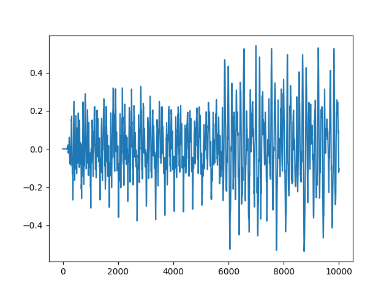 |  
--- | --- 
Time domain (Waveform) | Frequency domain (Spectrogram, STFT) -->
<p align="center">
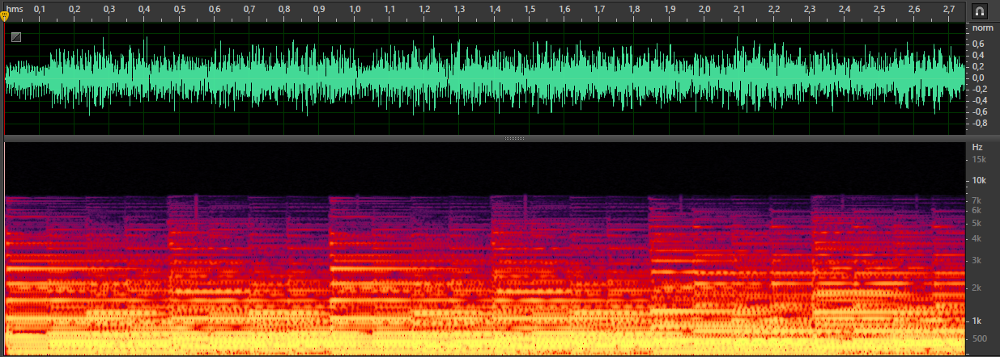
</p>
<p align="center">
Example of the Keyboard visualized in Adobe Audition.
<br>
Top: Time domain (Waveform), Bottom: Frequency domain (Spectrogram, STFT)
</p>

The spectrograms are computed from the audios using the ``librosa.stft()`` function with a Hanning window of size 1024 and an overlap of 50% (hop size of 512), which gives a resolution of 513 frequency bins. The Sampling Rate of the input audio is 44.1kHz. These parameters have been found to provide a reasonable time-frequency compromise for this application. 

>The original Sampling Rate of 16kHz of the NSynth dataset makes the spectrograms have no content above 8kHz, according to the [Nyquist-Shannon sampling theorem](https://en.wikipedia.org/wiki/Nyquist–Shannon_sampling_theorem). Since the spectrograms are computed up to 22.05kHz in this case, as we use a Sampling Rate of 44.1kHz for professional audio, it is safe to trim one half of the image corresponding to High Frequencies because there is no content (i.e. the magnitude is all zeros in this region).

### Forward pass

Strictly speaking, the values of the Spectrogram returned by the STFT operation are complex numbers. Therefore, for the network to process the data it needs to be decomposed further. The magnitude of the signal is the modulus of Spectrogram, namely ``np.abs(S)`` and the phase of the signal is the angle, obtained as ``np.angle(S)``. 

The component that carries the most relevant information is the magnitude, and it is the only one passed to the network, as shown in the following diagrams:

#### Fixed instrument pair
<p align="center">

</p>
<p align="center">
Diagram of the end-to-end audio processing pipeline for a fixed instrument pair. 
<br>
The STFT and iSTFT correspond to the forward and inverse Short Time Fourier Transforms respectively. The magnitude is processed at the Pix2Pix block, which returns a magnitude estimation as output. The phase is processed at the Phase estimator block, with one of the implementations <a href="#reconstructing-the-audio">discussed below</a>.   
</p>

#### Multitarget
<p align="center">

</p>
<p align="center">
Diagram of the end-to-end audio processing pipeline for the conditioned multitarget model. 
<br>
The Pix2Pix block now receives 2 magnitude inputs to generate a magnitude with the content of the input audio as played by the instrument in style target audio. 
</p>

### Reconstructing the audio

Both magnitude and phase are required to reconstruct the audio from a Spectrogram, so we need to estimate the phase in some way.

Generating flat or random phases does not produce a decent result. Therefore, a more sophisticated phase estimation method is also necessary. The following can be implemented in the “Phase estimator” block as possible solutions: 

1. [Griffin-Lim algorithm](https://pdfs.semanticscholar.org/14bc/876fae55faf5669beb01667a4f3bd324a4f1.pdf)
2. [Reconstruction using the input phase](https://posenhuang.github.io/papers/DRNN_ISMIR2014.pdf) (the phase estimator is the identity function)
3. Use another Pix2Pix network to learn the phase
4. Pass magnitude and phase as 2 channels to a single Pix2Pix network

Some authors from the research literature claim that (1) may not converge into an acceptable result for this particular problem [[i](https://arxiv.org/pdf/1811.09620.pdf) [ii](http://recherche.ircam.fr/pub/dafx11/Papers/27_e.pdf)], and any of the proposals in (3,4) are error prone since they will likely produce inconsistent spectrograms that are not invertible into a time-domain signal [iii](http://www.jonathanleroux.org/pdf/Gerkmann2015SPM03.pdf). 

Consequently, (2) has been chosen for being the one with less computational cost, less error prone, and best perceptual output quality.

<!-- > References of this section
> * i - [TimbreTron: A WaveNet(CycleGAN(CQT(Audio))) Pipeline for Musical Timbre Transfer]()
> * ii - [Phase Processing for Single-Channel Speech Enhancement] -->

# Dataset
>[Table of contents](#table-of-contents)

Given the description of the problem, the dataset must contain the same audios played by different instruments. Unfortunately, this is very complex to achieve with human performances because of time alignment, note intensity differences, or even instrument tuning changes due to their physical construction. 

For this reason, the audios of the dataset have been synthesized from MIDI files to obtain coherent and reliable data from different instruments. By doing this we ensure that the only change between two audios is the timbre, although this has its own limitations. 

### Dataset download

The dataset has been created using a combination of two publicly available datasets:

* Classical Music MIDI, from Kaggle: https://www.kaggle.com/soumikrakshit/classical-music-midi

* The NSynth Dataset, “A large-scale and high-quality dataset of annotated musical notes”, Magenta Project (Google AI): https://magenta.tensorflow.org/datasets/nsynth

### Alternative dataset

The MAESTRO Dataset contains more than 200 hours of music in MIDI format and can be used to generate an even larger collection of synthesized music. Although the resulting size of the synthesized dataset made it impractical for the scope of this project, the author encourages other researchers with more computing resources to try this option as well. 

* The MAESTRO Dataset “MIDI and Audio Edited for Synchronous TRacks and Organization”, Magenta Project (Google AI): https://magenta.tensorflow.org/datasets/maestro

### Audio synthesis

The audios are generated from these 2 datasets by loading the notes from the MIDI file as a sequence of (pitch, velocity, start_time, end_time). Then, the corresponding note from the NSynth dataset is loaded, modified to the note duration, and placed into an audio file. After repeating these two steps for all the notes in the sequence, the piece from the MIDI file is synthesized as illustrated in this diagram:
<p align="center">
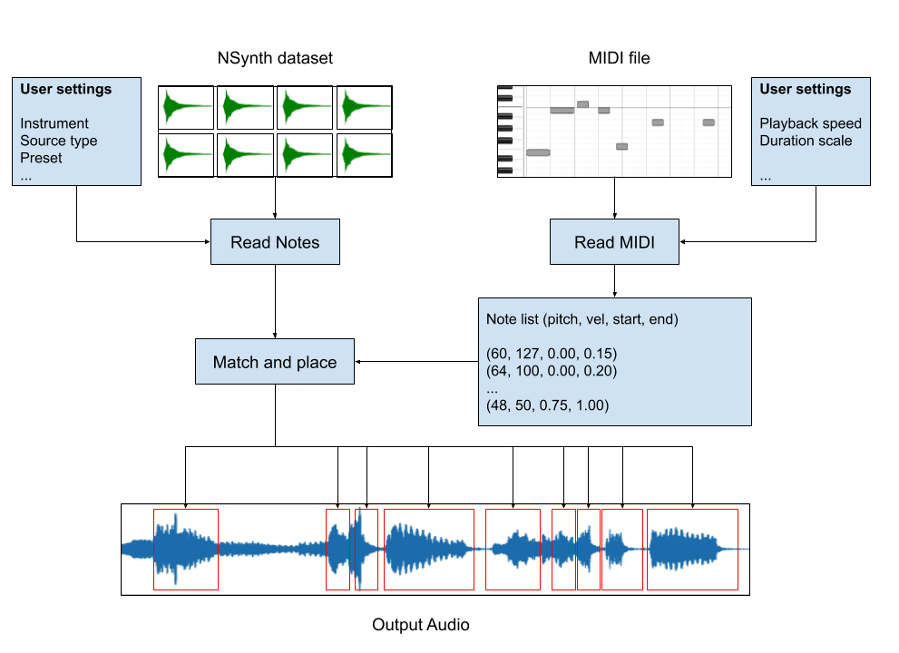
</p>
<p align="center">
Audio synthesizer block diagram. The notes from the MIDI file and the notes from NSynth are combined into a synthesized output audio. 
</p>

The procedure has been done with all the MIDI files in [Classical Music MIDI](https://www.kaggle.com/soumikrakshit/classical-music-midi) and with the following instruments from [The NSynth Dataset](https://magenta.tensorflow.org/datasets/nsynth) in the preset 0:
* keyboard_acoustic
* guitar_acoustic
* string_acoustic
* synth_lead_synthetic

### Pre/Post processing

The Magnitude Spectrograms are converted from linear domain to logarithmic domain using the function ``amplitude_to_db()`` within the ``data.py`` module, inspired from librosa but adapted to avoid zero-valued regions. The implication of this is that the magnitudes are in decibels (dB), and the distribution of the magnitude values is more similar to how humans hear.  

The minimum magnitude considered to be greater than zero is amin, expressed as the minimum increment of a 16 bit representation (-96 dB).    
```python
amin = 1 / (2**16)
mag_db = 20 * np.log1p(mag / amin)
mag_db /= 20 * np.log1p(1 / amin) # Normalization
```

Finally, the range is normalized in [-1,1] instead of [0,1] using the following conversion:
```python
mag_db = mag_db * 2 - 1
```

To recover the audio, the inverse operations must be performed. Denormalize to [0,1], convert from logarithmic to linear using the function ``db_to_amplitude()`` from ``data.py``, and then compute the inverse STFT using ``librosa.istft()`` with the magnitude and the phase estimations. The complex spectrogram and the final audio can be obtained from the magnitude and phase as: 
```python
S = mag * np.exp(1j * phase)
audio = librosa.istft(S,...)
```

# Training
>[Table of contents](#table-of-contents)

The adversarial networks have been trained in a single GTX 1080Ti GPU for 100 epochs using magnitude spectrograms of dimensions (256,256,1), a validation split of 0.1, 22875 examples per instrument pair, Adam optimizer, and Lambda of 100 as in the original Pix2Pix paper. 

### Batch size

After some inconclusive experiments setting the batch size to 1, 2 and 4, the best convergence has been achieved using a batch size of 8. This gives a total of 2859 iterations per epoch.

### Learning rate

The learning rate has been searched using the Learning Rate Finder method mentioned in [this blog post from Towards Data Science](https://towardsdatascience.com/estimating-optimal-learning-rate-for-a-deep-neural-network-ce32f2556ce0) and [this paper](https://arxiv.org/pdf/1506.01186.pdf). 

The search was performed separately for the generator, the discriminator and the joint adversarial system. The best learning rate is not the lowest loss, but the one with the steepest slope. This example shows the results for keyboard_acoustic_2_guitar_acoustic: 

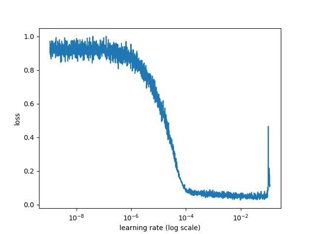 | 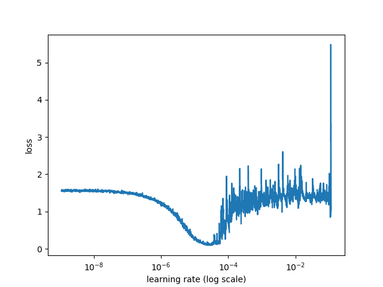 |  
--- | --- | --- 
Generator MAE | Discriminator loss | Joint GAN loss

Not only the learning rate has been found to be orders of magnitude lower than expected, but also different for the Generator and the Discriminator depending on the instrument pair. The optimal values found with this method are the following: 

Origin | Target | Generator LR | Discriminator LR
--- | --- | --- | ---
keyboard_acoustic | guitar_acoustic | 5e-5 | 5e-6
keyboard_acoustic | string_acoustic | 1e-5 | 1e-5
keyboard_acoustic | synth_lead_synthetic | 1e-4 | 1e-5
keyboard_acoustic | any | 1e-5 | 5e-6

### Training phase

The training history is displayed below for the 100 training epochs, using all the instrument pairs with keyboard_acoustic as origin.  

#### keyboard_acoustic_2_guitar_acoustic
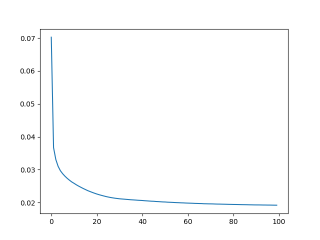 | 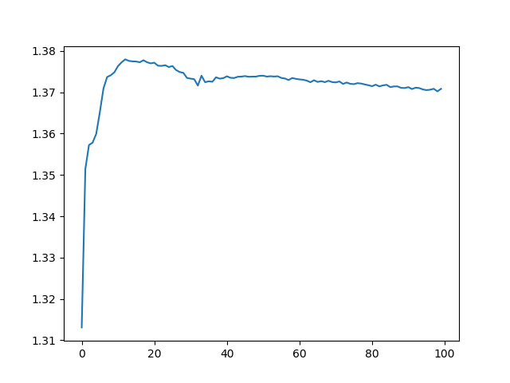 | 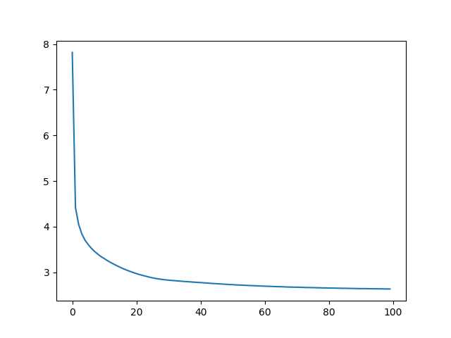 
--- | --- | --- 
Generator MAE | Discriminator loss | Joint GAN loss
(best = 0.0192, last = 0.0192) | (best = 1.3131, last = 1.3708)  | (best = 2.6338, last = 2.6338) 

#### keyboard_acoustic_2_string_acoustic
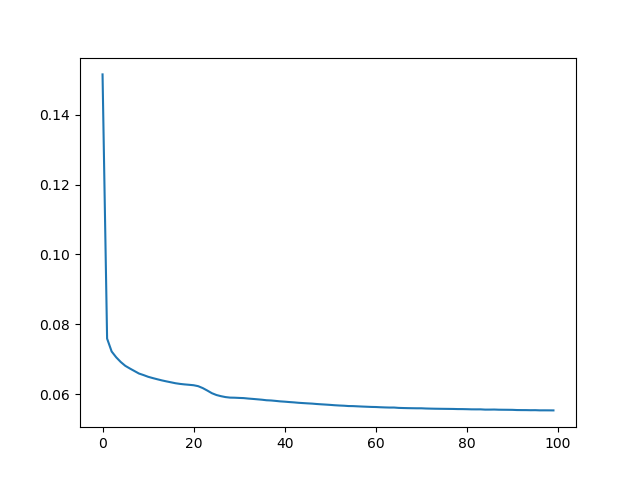 |  | 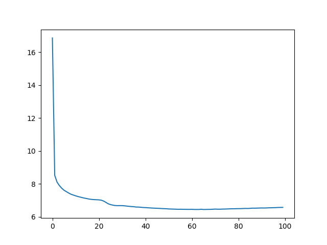 
--- | --- | --- 
Generator MAE | Discriminator loss | Joint GAN loss
(best = 0.0553, last = 0.0553) | (best = 0.6853, last = 1.0921)  | (best = 6.4461, last = 6.5735) 

#### keyboard_acoustic_2_synth_lead_synthetic
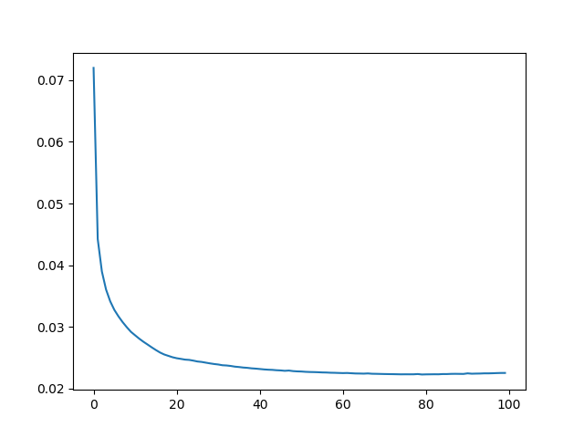 | 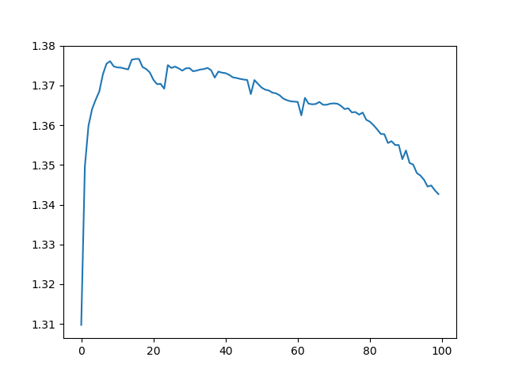 | 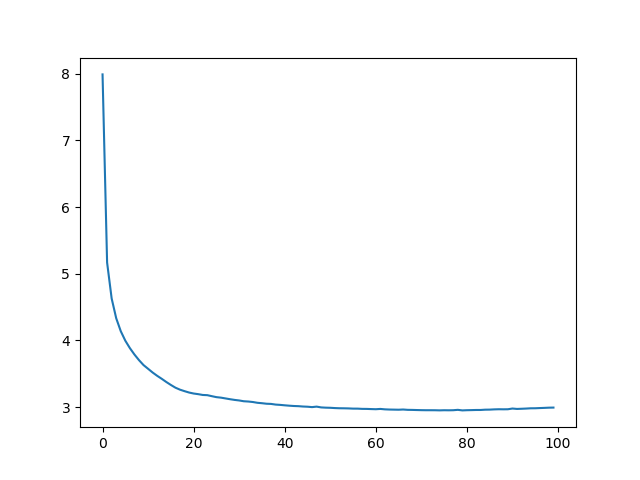 
--- | --- | --- 
Generator MAE | Discriminator loss | Joint GAN loss
(best = 0.0222, last = 0.0225) | (best = 1.3097, last = 1.3426)  | (best = 2.9503, last = 2.9925) 

# Results
>[Table of contents](#table-of-contents)

The numeric value of the loss can serve as a performance metric during training, but the most important part of this applied work is to observe the results subjectively. This section showcases the results both visually and with audios. 

At the end of every training epoch the same audio file has been used to generate a spectrogram frame and the corresponding audio with the target timbre. 

### Visualizations

#### keyboard_acoustic_2_guitar_acoustic
 |  |  
--- | --- | ---
Input spectrogram | Prediction over 100 epochs | True target

#### keyboard_acoustic_2_string_acoustic
 |  |  
--- | --- | ---
Input spectrogram | Prediction over 100 epochs | True target

#### keyboard_acoustic_2_synth_lead_synthetic
 |  |  
--- | --- | ---
Input spectrogram | Prediction over 100 epochs | True target

### Audios

#### keyboard_acoustic_2_guitar_acoustic

[Keyboard acoustic](https://drive.google.com/open?id=16SWVM3JSN_PM6pcNvPzWbiUYZs328u8F) | 
[Guitar acoustic](https://drive.google.com/open?id=1hGWHfV03yok2NSfXipK7KDVp9kTbUbjH) | 
[keyboard_acoustic_2_guitar_acoustic]()
--- | --- | --- 
Input | Target | Prediction

#### keyboard_acoustic_2_string_acoustic

[Keyboard acoustic](https://drive.google.com/open?id=16SWVM3JSN_PM6pcNvPzWbiUYZs328u8F) | 
[String acoustic](https://drive.google.com/open?id=1mpaovd5T2IaXee2CyOWrUXEXRHg64LeB) | 
[keyboard_acoustic_2_string_acoustic](https://drive.google.com/open?id=1HovCh4rNnPemSeQLVfdCdudaxFxY4mOt)
--- | --- | --- 
Input | Target | Prediction

#### keyboard_acoustic_2_synth_lead_synthetic

[Keyboard acoustic](https://drive.google.com/open?id=16SWVM3JSN_PM6pcNvPzWbiUYZs328u8F) | 
[Synth Lead synthetic](https://drive.google.com/open?id=1VKfm4iGLnDPLn3BZ14yAcv5wFA6-bMms) | 
[keyboard_acoustic_2_synth_lead_synthetic](https://drive.google.com/open?id=12exCypMTuDLVe_t6aEMq2gBXMFN46Xl1)
--- | --- | --- 
Input | Target | Prediction

### Trained models

The ``/models`` folder of this repository contains the training history and the learning rate search results in separate directories for each instrument pair.

Since the weights of the trained models are too large for the Github repository, [this alternative link to Google Drive](https://drive.google.com/open?id=1baKYIA3uurrXkh1V0-fMWkgvW4iEWJh8) is provided. 

Individual models
* [keyboard_acousitc_2_any]()
* [keyboard_acoustic_2_guitar_acoustic](https://drive.google.com/open?id=1wD9jHDkwMSaPQeCpM6UxnOQfh-C52pI0)
* [keyboard_acoustic_2_string_acoustic](https://drive.google.com/open?id=1TUMI0NK9hP26BqiQUAqNa7woHJ23JoME)
* [keyboard_acoustic_2_synth_lead_synthetic](https://drive.google.com/open?id=1LuriwjzxN3C5SJzeDFZllEOMtjZcUDYf)

To use a pretrained model simply run the ``predict.py`` script specifying the path to the trained model, the location of the input audio and the name of the output audio.
```
$ python predict.py --model <GENERATOR_WEIGHTS> 
                    --input <INPUT_AUDIO>
                    --output <OUTPUT_AUDIO>
```

Additionally, in the case of a multitarget model the style must be specified. Run the ``predict_multitarget.py`` script instead.
```
$ python predict_multitarget.py --model <GENERATOR_WEIGHTS> 
                                --input <INPUT_AUDIO>
                                --style <TARGET_STYLE_AUDIO>
                                --output <OUTPUT_AUDIO>
```

# Conclusion 
>[Table of contents](#table-of-contents)

# Future work
>[Table of contents](#table-of-contents)

There are some aspects of this work which have a considerable margin for improvement with further research. In this section, the author’s intention is to highlight some of the main lines to be followed in the future in the hope that they will help the research in this field. 

### Diversity of instruments

As mentioned in the section [Dataset](#dataset), the single notes contained in the NSynth Dataset were used to synthesize the audios. In particular, the entire training has been performed using the preset 0 of each instrument pair. However, it may be interesting to experiment with other presets. 

Another way could be to create a custom dataset with the same structure as NSynth using a SoundFont synthesizer for each new instrument (.sf, .sf2 files).

### Data augmentations

Generate different versions of the audios by changing synthesis parameters, transposition, tempo, note length, etc.  or applying audio effects used in professional audio productions such as Reverb, EQ or Delay. 

Alternatively, consider using the MAESTRO Dataset as mentioned in the section [Dataset](#dataset) if you have more time and resources for your research.

### Conditional architecture (any_2_any)

The scope of this project has been limited to explore 3 instrument pairs, having only one pair fixed for each model. In other words, the model converts a specific origin into a specific target and cannot perform the timbre transfer operation properly if the origin or target instruments change. 

The proposed setting is similar to the neural style transfer problem. To condition the network to generate any instrument of the user’s choice, random notes played by the target instrument can be passed as an additional input. The task would be not just to perform a predetermined transformation, but to analyze input and target simultaneously to generate the prediction. 

# Acknowledgements
>[Table of contents](#table-of-contents)

I would like to thank Carlos from the [YouTube channel DotCSV](https://www.youtube.com/channel/UCy5znSnfMsDwaLlROnZ7Qbg/videos) for organizing the [Pix2Pix challenge](https://www.youtube.com/watch?v=BNgAaCK920E) and elaborating a [tutorial on how to implement and train this architecture](https://www.youtube.com/watch?v=YsrMGcgfETY). The code and the tutorial were used as a starting point and adapted to the problem needs. Also, special mention to NVIDIA Corporation for providing the prize as a sponsorship for the challenge. 

The challenge has been a major motivation to do this research on the topic of Timbre Transfer and develop this code. Regardless of the outcome of the challenge, I hope this work to be helpful in some way in further Machine Listening research.  

Finally, thank you to various faculty members from the [Music Technology Group (MTG) at Universitat Pompeu Fabra](https://www.upf.edu/web/mtg) in Barcelona (Spain) for their valuable feedback and continuous support to my career since I was an undergraduate student there.

# Contact
>[Table of contents](#table-of-contents)

Please do not hesitate to reach out to me if you find any issue with the code or if you have any questions. 
* Personal email: hmartelb@hotmail.com
* LinkedIn profile: https://www.linkedin.com/in/hmartelb/

# License
>[Table of contents](#table-of-contents)

```
MIT License

Copyright (c) 2019 Héctor Martel

Permission is hereby granted, free of charge, to any person obtaining a copy
of this software and associated documentation files (the "Software"), to deal
in the Software without restriction, including without limitation the rights
to use, copy, modify, merge, publish, distribute, sublicense, and/or sell
copies of the Software, and to permit persons to whom the Software is
furnished to do so, subject to the following conditions:

The above copyright notice and this permission notice shall be included in all
copies or substantial portions of the Software.

THE SOFTWARE IS PROVIDED "AS IS", WITHOUT WARRANTY OF ANY KIND, EXPRESS OR
IMPLIED, INCLUDING BUT NOT LIMITED TO THE WARRANTIES OF MERCHANTABILITY,
FITNESS FOR A PARTICULAR PURPOSE AND NONINFRINGEMENT. IN NO EVENT SHALL THE
AUTHORS OR COPYRIGHT HOLDERS BE LIABLE FOR ANY CLAIM, DAMAGES OR OTHER
LIABILITY, WHETHER IN AN ACTION OF CONTRACT, TORT OR OTHERWISE, ARISING FROM,
OUT OF OR IN CONNECTION WITH THE SOFTWARE OR THE USE OR OTHER DEALINGS IN THE
SOFTWARE.
```
